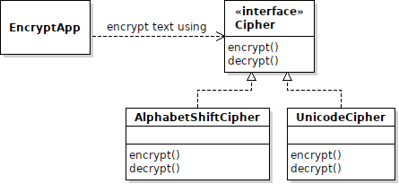

## Using Strategy Pattern in the Encryption-Decryption Problem

The *Strategy Pattern* is used when you have different
algorithms that can be used to perform a task, and you
want to be able to change or select which algoritm is used.

The way to apply this pattern is:

1. Define an interface for the Strategy.  It has whatever method(s) you need to perform the task.

2. For each algorithm, define a class that implements the Strategy interface.

3. In the application (called the *Context*) define an attribute to hold a reference to a concrete Strategy object, and call its method(s) when you want to perform the task.


### Applying the Pattern

The Encryption-Decryption problem uses an algorithm to perform encryption 
and decryption.  Such algorithms are called *Ciphers*, and there are many
of them.

Define a `Cipher` interface and concrete classes for actual ciphers.



### What Are the Parameters?

What should be the parameters to `encrypt` and `decrypt`?
A Strategy needs parameters (data) in order to perform its task.

In the Encrypt-Decrypt problem we read *characters* from an InputStream.
So we should give the cipher strategy an InputStream or Reader for data.

The output goes to System.out or a file, so we should also give 
an OutputStream or Writer for output.

You can also use an array of chars as parameters, and let some other
part of your application handle reading and writing to streams.

Finally, the Cipher needs a `key` for the algorithm.

So you could have an interface like this:

<table align="center" border="1">
<tr>
<th>
&lt;&lt;interface&gt;&gt;<br>
Cipher
</th>
</tr>
<tr>
<td markdown="span">
encrypt(Reader in, Writer out, int key) <br>
decrypt(Reader in, Writer out, int key) 
</td>
</tr>
</table>

or:

<table align="center" border="1">
<tr>
<th>
&lt;&lt;interface&gt;&gt;<br>
Cipher
</th>
</tr>
<tr>
<td markdown="span">
encrypt(char[] in, char[] out, int key) <br>
decrypt(char[] in, char[] out, int key)
</td>
</tr>
</table>

or return the result:

<table align="center" border="1">
<tr>
<th>
&lt;&lt;interface&gt;&gt;<br>
Cipher
</th>
</tr>
<tr>
<td markdown="span">
encrypt(char[] in, int key): char[] <br>
decrypt(char[] in, int key): char[]
</td>
</tr>
</table>

`Writer` is a standard interface for writing characters and arrays of characters.
You can use a `PrintWriter` to write to a file.
`System.out` is not a Writer, 
but you can "wrap" System.out in a PrintWriter object:
```java
PrintWriter out = new PrintWriter(System.out);
```

### Do we really want 3 parameters?

In the encrypt application, the `key` doesn't change.

So, we can simplify the method signatures for `encrypt` and `decrypt`
by setting the `key` in the constructor of the actual Cipher class.
Or, add a `setKey(int)` method to the `Cipher` interface.

Then the interface would simplify to:

<table align="center" border="1">
<tr>
<th>
&lt;&lt;interface&gt;&gt;<br>
Cipher
</th>
</tr>
<tr>
<td markdown="span">
encrypt(Reader in, Writer out)<br>
decrypt(Reader in, Writer out) 
</td>
</tr>
</table>

or use `char[]` arrays for input and output.

### What About -data "string"?

The Cipher interface shown above works for reading from a file,
but what about the case where you want to encrypt a String?
The application has a command line argument `-data "string to encrypt"`,
so you need a way to encrypt a string.

There is `StringReader` class that can handle this case:

```java
Reader in = new StringReader("encrypt this string");
```

### Creating and Using a Cipher

In your application class, you would have code like this:

```java
int key = /* key read from command line */;

Cipher cipher = new UnicodeCipher(key);
if (mode.equals("dec"))
    cipher.decrypt(in, out);
else
    cipher.encrypt(in, out);
```

### Use a Factory Method to Create the Cipher

The application class needs to create a cipher somehow.
This creates coupling between the application and the specific ciphers:

```java
if (alg.equals("shift"))
    cipher = new AlphabetShiftCipher();
else if (alg.equals("unicode"))
    chiper = new UnicodeCipher();
```

As suggested in the Hyperskill project, you can make your 
app more flexible by writing a Factory class that creates Cipher objects.

The simplest possible factory just has a static method:

```java
String alg = "unicode"; // read from command line arguments
int key = 0;            // read from command line arguments

Cipher cipher = CipherFactory.getCipher(alg, key);
```

To add a new Cipher just modify the CipherFactory. The rest of the application doesn't change.

