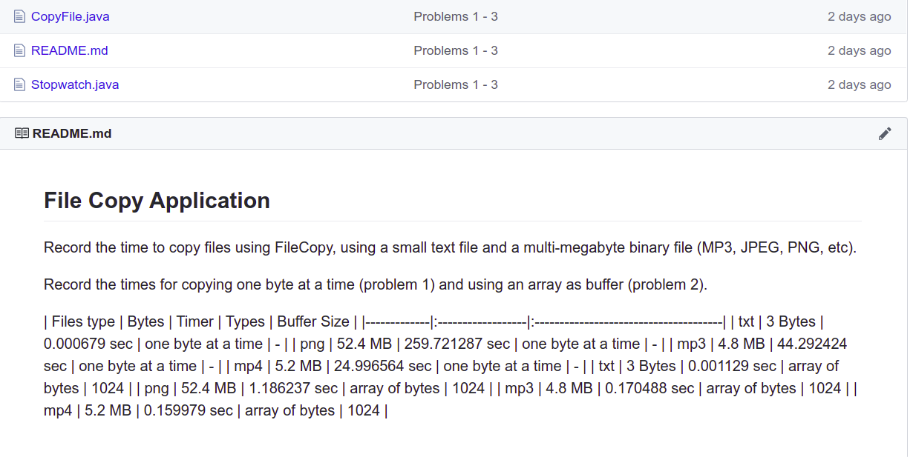
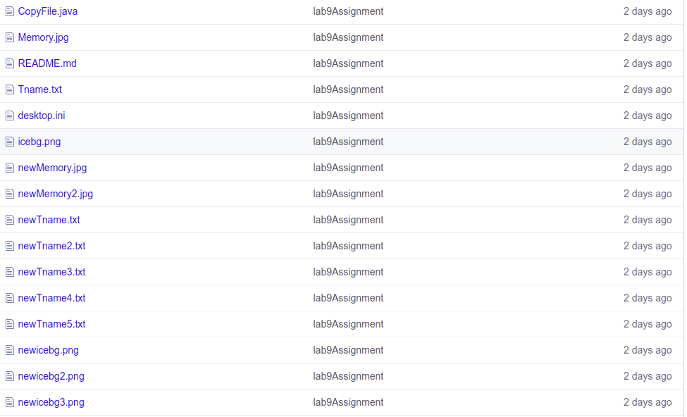

## Problem 2: CopyFile

Problem 2 requires only 3-4 lines of code.   
And its easy to check if your code works correctly or not.
Just run it and verify the code is same as original file.

Yet, **60%** of the submitted codes are wrong!

Here is an example of testing a student code (with comments):

```
// change directory to where the code is
> cd workspace/Student/lab9

// compile the code
> javac CopyFile.java

// create a test file in another directory
> echo "hi" > /tmp/hello
// check the file. "3" mean the size is 3 bytes
> ls -l /tmp/hello
-rw-r--r-- 1 jim jim    3 Mar 20 12:46 /tmp/hello
// copy the file
> java CopyFile /tmp/hello /tmp/hello2
// check the result
> ls -l /tmp/hello*
-rw-r--r-- 1 jim jim    3 Mar 20 12:46 /tmp/hello
-rw-r--r-- 1 jim jim 1024 Mar 20 12:47 /tmp/hello2

BUG. hello2 is 1024 bytes long.
```

Another test: copy a PNG file and examime the copy.

```
> java CopyFile /tmp/dilbert.png /tmp/dilbert2.png

> ls -l /tmp/dilbert*
-rw-r--r-- 1 jim jim 64369 Mar 20 12:51 /tmp/dilbert.png
-rw-r--r-- 1 jim jim 64512 Mar 20 12:52 /tmp/dilbert2.png

> gimp /tmp/dilbert2.png
(it works! Image looks ok, but...)

> cmp /tmp/dilbert.png /tmp/dilbert2.png
EOF on /tmp/dilbert.png after byte 64369
(one file is shorter than the other)
```

## Compare

I tested using the following comparisons:

* Identical 1 byte files
* Two 1 byte files that differ
* A 1 byte and 2 byte file where first byte is same
* Two identical long files (approx 12,000 bytes)
* Two long files where last byte is different
* Two long files that are almost same but one has 3 extra bytes
* Compare a file to a non-existing file
* Only one command line argument (should print usage message)
* No command line arguments (should print usage message)

To check your code, compare your program output to the `cmp` command
(Linux, MacOS, and GNU/Bash shell) or `fc /b` (Windows).

## WordCount

I used 5 test files and one non-existent filename.

See [lab9-test](https://github.com/OOP2020/lab9-test) repository.

Here are the files and correct outputs.
When I run the tests the files are in the `/tmp` directory.
On your computer the files may be in a different directory.

| File        |  Expected Output                      |
|:------------|:--------------------------------------|
| emptyfile   | 0 0 0 /tmp/emptyfile                  |
| blankfile   | 3 0 6 /tmp/blankfile                  |
| oneline     | 1 4 22 /tmp/oneline                   |
| Quotes.txt  | 21 80 521 /tmp/Quotes.txt             |
| Alice.txt   | 1207 9660 52540 /tmp/Alice.txt        |
| nonexistent | /tmp/nonexistent does not exist.      |

Final test is to enter four files on one command line:
```
java WordCount emptyfile blankfile oneline Quotes.txt
```
Output:
```
0 0 0 /tmp/emptyfile
3 0 6 /tmp/blankfile
1 4 22 /tmp/oneline
21 80 521 /tmp/Quotes.txt
1207 9660 52540 /tmp/Alice.txt
```

## Can You Write Correct Code?

*If the only way you can write correct code is for someone else
to give you an oracle, then you can't write correct code.*

That's why Lab 9 did not include test files.

## Developers Must Review and Test Their Code

* **Review Code** - take a break after coding, then carefully read the code line by line.
* **Test Code** - run the application, test for "edge" cases, etc. Compare results to the specification.


## Review Your Documents, Too!

A few students submitted a README.md that looks like this on Github:



You should check your Github repo after pushing work.
Fix the markdown.

## Check Your Repository

A few students committed a lot of test files (junk) to Github, like this:



You should commit only files related to your application.
To remove excess files use:

```
git rm filename 
git commit -m ...
```

you can specify many files in one `git rm` command.


## TAs are Not Testers

Its your job to test your own code.  TAs are not here to test for you.
