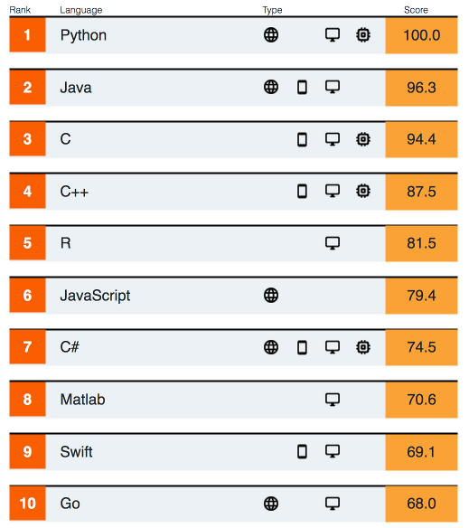

## Which Programming Language to Use in Programming 2 (*aka* OOP)?

We want:

* Good support for object-oriented programming
* Good documentation and available high-quality learning material
* Not too difficult to learn
* Valuable for jobs and useful in other SKE courses

### 2019 Most Popular Languages

1. [Tiobe Index][] 
   * based on "number of skilled engineers, courses and 3rd party vendors." Search engines are used to calculate results.
   * Dec 2019 Rankings:

    | Language  | Rating |
    |:----------|-------:|
    | Java      | 17.25% |
    | C         | 16.09% |
    | Python    | 10.31% |
    | C++       |  6.20% |
    | C#        |  4.80% |
    | VB .Net   |  4.74% |
    | Javascript|  2.09% |

2. [IEEE 2019 Language Survey][ieee-language-survey-article] has [interactive rankings][ieee-language-interactive] where you can customize criteria for rankings, e.g. number of jobs, number of apps, kind of applications.    
   

### Interesting Cases

* KU Computer Science OOP course used Python for 5 years, but decided it wasn't good for teaching object-oriented programming and switched to Java.
* Twitter was originally built using Ruby on Rails, but switched to the JVM platform (Java and Scala) for scalability.
* edX.org and Pinterest are built using Django, a Python web framework.
* [Programming Languages used in Popular Websites][web-sites-wikipedia] - both Python and Java are widely used.


### Top Choices: Java, Python, Kotlin

Java and Python are both widely used in professional programming.
Java is a top choice for server-side applications and for Android apps.
Python is the language of choice for AI and Machine Learning, and also used on server-side web apps.
microPython can be used on micro-controllers.

Kotlin is based on Java with a simpler syntax. 
Kotlin uses type inference, mutable/immutable data and object references,
and treats primitive types like objects (a nuisance in Java).
Google has adopted Kotlin as the preferred language for Android development (but Java can still be used).

A downside of Kotlin is: a) not as much tool support or learning material as Java and Python,
b) less demand in the job market, c) adds some conceptual complexity for beginners.

Java is a common choice for OOP courses. 
Kotlin, Scala, and Groovy are all based on Java and run on the JVM.  
If you know Java, then Kotlin, Scala, and Groovy are easy to learn. 

Google offers some free courses:

* [Kotlin Bootcamp Course][]
* [Kotlin Android Fundamentals][]

### My View

Java, Kotlin, and Python are all serious choices for OOP. 
Java has more complex syntax and some nuisances like primitive types and checked exceptions.
But, Java also is more widely used and has much more learning material.
The syntax is very similar to C# and somewhat similar to C++.  

Python is much easier to learn and more productive to code in.
Since Python is very flexible and dynamic, 
the programmer must understand what he's doing obey *conventions* to write good code,
such as not directly accessing object attributes from other classes,
using type hints, and using O-O constructs as they were intended.

Kotlin has everything that Java has, but omits some blemishes.
Primitive types are handled like object references for consistency,
but internally stored as primitives for efficiency.  
All exceptions are unchecked, so you are never forced to use "try - catch" (like Python).
Kotlin has nullable objects and forces the progranmer to recognize where they occur.
Kotlin code can be written as top-level functions (no class or object wrapper), like Python.


Comparing Java and Python

| Java                             | Python                                |
|:---------------------------------|:--------------------------------------|
| Statically typed                 | Dynamic typing, "*duck typing*"       |
| Compile before run               | No pre-compile, uses JIT compilation  |
| Compiler checks for syntax errors| Errors found at run-time              |
| Compiler checks data types       | Type hints and mypy to find type errors |
| Platform independent             | Platform independent                  |
| All code is in classes           | Code in classes, top-level functions, or scripts |
| Verbose syntax                   | Very concise syntax                   |
| Primitive types are value types  | All data types are objects            |
| Data & code can be private       | Everything is public                  |
| Great API documentation          | Very good API documentation           |

### "Hello, Nerd" Application

Ask a person for his name and say hello.

In Python:
```python
"""
Ask a person for his/her name and greet the person.
This code uses type hints to demonstrate their use.
"""

def greet(name: str) -> None:
    """Greet a person by name.

    Args:
       name - the person's name
    """
    print("Hello,", name)

if __name__ == "__main__":
    name = input("What's your name? ")
    greet(name)
```

In Java:
```java
import java.util.Scanner;
/**
 * Ask a person his/her name and greet the person.
 */
public class Greeter {
    /**
     * Greet a person by name.
     * @param name is the person's name
     */
    public static void greet(String name) {
        System.out.println("Hello, "+name);
    }

    public static void main(String[] args) {
        // Scanner is used to read input, parse it, and return values
        Scanner console = new Scanner(System.in);
        System.out.print("What's your name? ");
        String name = console.nextLine();
        greet(name);
    }
}
```
In Kotlin (written as a singleton object, for comparison with Java):
```kotlin
/**
 * Ask a person his/her name and greet the person.
 */
object Greetme {
    /**
     * Greet a person by name.
     * @param name is the person's name
     */
    fun greet(name: String) {
        println("Hello, " + name)
    }

    @JvmStatic
    fun main(args: Array<String>) {
        print("What's your name? ")
        val name = readLine()
        greet(name)
    }
}
```


[Tiobe Index]: https://www.tiobe.com/tiobe-index/
[ieee-language-survey-article]: https://spectrum.ieee.org/computing/software/the-top-programming-languages-2019
[ieee-language-interactive]: https://spectrum.ieee.org/static/interactive-the-top-programming-languages-2019
[web-sites-wikipedia]: https://en.wikipedia.org/wiki/Programming_languages_used_in_most_popular_websites
[kotlin-for-android]: https://techcrunch.com/2019/05/07/kotlin-is-now-googles-preferred-language-for-android-app-development/
[the future of Android]: https://dzone.com/articles/why-kotlin-is-the-future-of-android-app-developmen
[Groovy]: https://groovy-lang.org
[Kotlin]: https://kotlinlang.org
[Scala]: https://scala-lang.org
[Spock]: https://spockframework.org
[Kotlin Bootcamp Course]: https://codelabs.developers.google.com/kotlin-bootcamp/
[Kotlin Android Fundamentals]: https://codelabs.developers.google.com/android-kotlin-fundamentals/
