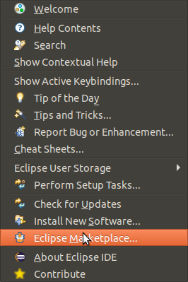
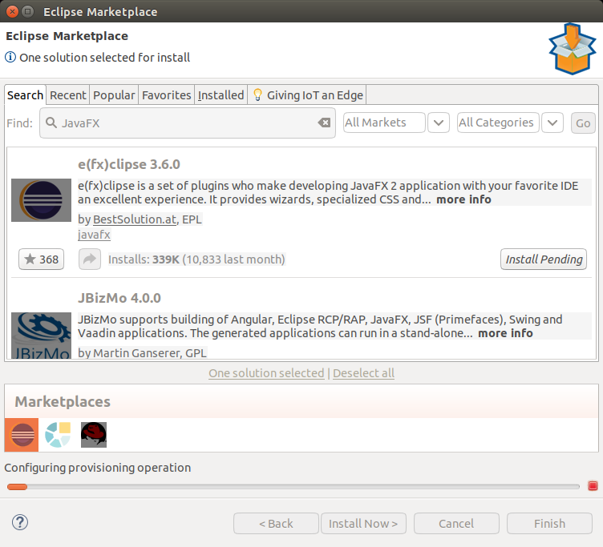
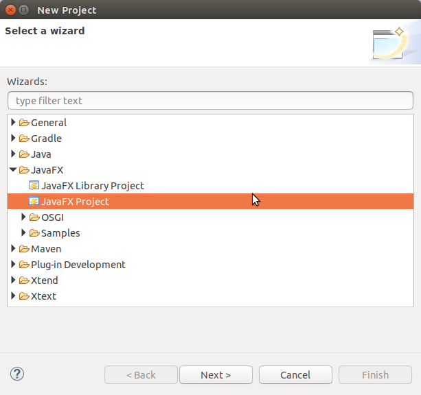
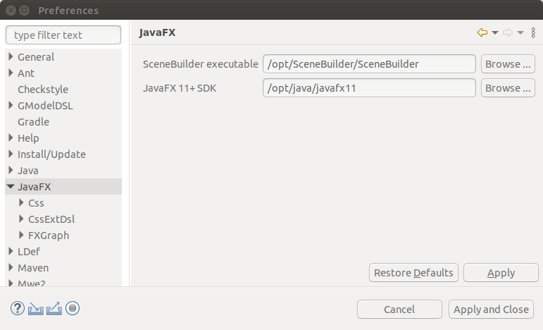

## JavaFX and SceneBuilder in Eclipse

To use JavaFX and SceneBuilder in Eclipse you need the following.
These instructions are for Java 11.  

If you are using Java 8, 
it already includes JavaFX (but not SceneBuilder).  Get SceneBuilder 8.x for Java 8.  Also note that Java 8 does not use "modules".

A summary of what you need is:

1. Install JavaFX 11 from [gluonhq.com](https://gluonhq.com/products/javafx/).
   * Install it somewhere where you can easily find it later -- not Desktop.
   * Don't use a path containing spaces.
2. Install SceneBuilder 11 from [gluonhq.com](https://gluonhq.com/products/scene-builder/)
   * Same installation guidance as for JavaFX
3. Add the e(fx)clipse Plugin to Eclipse, as shown below.
4. Use Eclipse Preferences to tell Eclipse where JavaFX and SceneBuilder are.

## Install e(fx)clipse Plugin

The **e(fx)clipse** adds features for creating JavaFX apps.
This plugin is not required, but it greatly improves productivity in
writing JavaFX apps and using SceneBuilder.

Step 1. Select the Help - Eclipse Marketplace menu item.

Step 2. Search for "JavaFX" in the search box.

Step 3. Find the "E(fx)clipse" plugin and click the "Install" button.  A dialog will appear with conditions for using the plugin. You have to agree to install it.

Step 4. Restart Eclipse (a dialog prompts you).

Step 5. Verify installation. Use the menus to create a new Project (not "Java Project").  In the "New Project Wizard" dialog, you should see JavaFX as a choice.
Don't create a project yet -- update your Eclipse Preferences first.

## Update Eclipse Preferences

1. Open the "Window" menu and choose **Preferences**

2. Expand the **JavaFX** item on left side.

3. Use "Browse..." to locate and select the SceneBuilder executable file.

4. Use "Browse..." to select the JavaFX directory (base directory containing JavaFX lib/, docs/, etc).

5. Click "Apply and Close"

