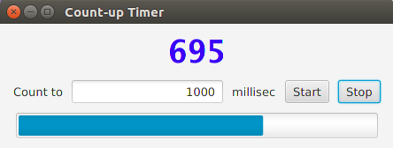

## Worker Threads in Graphical Applications

A task that may run for a "long" time, even a few seconds,
should normally be run on a separate thread to avoid freezing the UI.

## Example: A Counter Without threads

This example shows what happens if you start a long-running
task on the UI thread.

Download this code:

The program counts from 0 to some limit, in milliseconds.

<p align="center">

</p>

**Exercise:** Run the application. Type a number (e.g. 2000) and press "Start". Does the UI behave well?  Can you stop the counter?

You can see the count printed on console, but it is not updated in the window until the counter loop finishes.

**Examine the Code:** There is an inner class named *CountUp* that does the work.

**run()** counts from 0 to totalCount. It updates the UI and the ProgressBar.

**stop()** stops the run() method by setting `cancelled=true`.

Components in the UI are:

| field name    | Usage                       |
|---------------|-----------------------------|
| displayField  | Label at top displays count |
| inputField    | TextField for inputting a number |
| startButton   | Button with label "start" |
| stopButton    | Button with label "stop"  |
| progressBar   | ProgressBar at bottom     |

## Worker Threads and Services

To avoid an unresponsive UI, long-running or compute-heavy tasks
should be run in separate threads.
These threads are called *worker* threads and appear to run in the background.  

Example of worker threads:
* An app that downloads files. Each download is one or more worker threads.
* A notification service.  It uses a worker thread to periodically check for notifications.  The worker notifies the UI thread when a notification is received.

There are some special problems with using *worker* threads:

* How can you monitor the worker's progress?
* How do you get and display the result?
* How can the worker notify the UI thread of events?
* How can tje application cancel the worker thread?

GUI frameworks provide classes for worker threads.
These classes manage communication between background threads and the UI or "Application" thread.

* Android has `AsyncTask` class
* Swing has `SwingWorker` class
* JavaFX has a `Worker` interface with `Task` and `Service` classes


## Using a JavaFX Task

The JavaFX `Task` class implements the `Worker` interface. A `Task` is for a one-time job that you want to run in a worker thread.

The Worker interface and classes have many methods,
but they are easy to understand if you group them by
what they do.

The main methods of **Task** are:

<table border="1">
<tr align="center">
<td markdown="span" align="center">
**Task&lt;V&gt;**
</td>
</tr>
<tr align="left" valign="top">
<td markdown="span" align="left">
**Properties**    
message: String       
progress: double        
running: boolean    
state: Worker.State    
totalWork: double    
value: V    
</td>
</tr>
<tr align="left" valign="top">
<td markdown="span" align="left">
**Required Callback Method:**    
 V call()     
**Services:**     
updateMessage(String message)     
updateProgress(workdone, totalwork)    
updateValue(V value)      
**Controls**    
cancel()      
run()    
**Query Methods:**    
isCancelled()    
isRunning()     
getMessage()        
getProgress()    
getState()     
getValue()  
</td>
</tr>
</table>

The way to use worker threads is to define a
subclass of **Task** and implement the **call()** method.
The **call()** method can notify the UI of its progress
by calling the *Service* methods `updateValue()`, `updateProgress()`, and `updateMessage()`.

We will add a **CountUpTask** to the TimerController
to count from 0 to a limit using a worker thread.
You don't need to delete the existing code.

```java
/** A worker that counts slowly from 0 to a total count. */
class CountUpTask extends Task<Integer> {
    private int totalcount;
    private int count;

    public CountUpTask(int maxcount) {
        this.totalcount = maxcount;
        this.count = 0;
    }

    @Override
    public Integer call() {
        updateMessage("Starting");
        updateProgress(0, totalcount);
        // how often to update the progressbar?
        int increment = Math.max(totalcount/100, 2);
        while(count < totalcount) {
            count += 1;
            System.out.println(count); // for testing
            // Notification services from the superclass
            updateValue(count);  
            updateMessage(Integer.toString(count));
            if (count % increment == 0) updateProgress(count, totalcount);
            // wait for 1 millisecond (but not very accurate)
            try { Thread.sleep(1); }
            catch (InterruptedException ex) { break; }
        }
        // Return the result of the task
        return count;
    }  
}
```

The work is done in the `call()` method. This method
periodically notifies the UI thread of its progress by calling `updateValue(count)` ,`updateProgress`, and `updateMessage`.

### Running a Worker Thread

In JavaFX, you start worker threads using `Thread.start()`
or a Java Executor or ExecutorService.
In the controller class add this code:
```java
public class TimerController {

    private CountUpTask worker;

    /** Call this method to start the task. */
    public void startWorker(ActionEvent event) {
        int count = Integer.parseInt(inputField.getText());
		worker = new CountUpTask(count);
		// automatically update the progressBar using worker's progress Property
		progressBar.progressProperty().bind( worker.progressProperty() );
        // update the displayField whenever the value of worker changes:
		ChangeListener<Integer> listener = new ChangeListener<Integer>() {
			@Override
			public void changed(ObservableValue<? extends Integer> observable,
					Integer oldValue,
					Integer newValue) {
				displayField.setText(newValue.toString());
			}
		};
        // add the observer (ChangeListener)
        worker.valueProperty().addListener( listener );
		new Thread(worker).start();
    }
}
```

We also need a way to stop the task.  Define a stopWorker method to cancel the worker:
```java
    /** Call this method when Stop button is pressed. */
    public void stopWorker(ActionEvent event) {
        worker.cancel();
    }
```

Finally, use `startWorker` and `stopWorker` as Event Handler methods for the start and stop buttons in the UI.
In the `initialize()` method change the code to:
```java
    @FXML
    public void initialize() {
        startButton.setOnAction( this::startWorker );
        stopButton.setOnAction( this::stopWorker );
    }
```

Run the application.  Is it more responsive?


## Properties

JavaFX uses lots of observable **properties** for values.
The Worker Task class `progress` attribute is an observable Integer Property, and the `value` is also an observable Property.
JavaFX gives you 2 ways to access these fields:

| Method               | What is does |
|----------------------|--------------|
| double getProgress() | get the current value of progress |
| progressProperty()   | get observable property for progress |
| Integer getValue()   | get current result of worker |
| valueProperty()      | get observable property for value |


To update the `displayField` whenever the worker updates the value property,
we add an "observer" which in this case is a `ChangeListener`:

```java
ChangeListener<Integer> listener = new ChangeListener<Integer>() {
    @Override
    public void changed(ObservableValue<? extends Integer> observable,
            Integer oldValue, Integer newValue) {
        displayField.setText( newValue.toString() );
    }
};
// add observer to the value Property
worker.valueProperty().addListener( listener );
```

 Many JavaFX controls (and other classes) let you directly "bind" one of their properties to a property on another object.
 Some bindings are one-way and some are bidirectional (either side of the "binding" can update the other).
 So, we "bind" the value of the ProgressBar (a double value) directly to the Worker's progress property (also a double):
```java
progressBar.progressProperty().bind( worker.progressProperty() );
```

This is like adding a ChangeListener to update the progressbar, but a lot less code.

Instead of writing a ChangeListener for the `value` property, we could bind the `displayField` String `text` property directly to the Worker's `message` property (also a String):
```java
displayField.textProperty().bind( worker.messageProperty() );
```

**Note** that this means the Controller *assumes* that the Worker always updates the `message` property with the current value of the counter.  An additional bit of coupling between the two objects.


## Using Hook Methods for Extra Functionality

A **hook* method is an optional method used to add some additional
functionality to existing code.  They are often used in frameworks.

A Worker task or service is always in one of these states:

* State.READY - ready to be executed, but not yet run
* State.SCHEDULED - scheduled for execution but not yet running
* State.RUNNING - worker is running
* State.CANCELLED - worker was cancelled
* State.SUCCEEDED - call() method completed successfully, result is ready to be read from the *value* property
* State.FAILED - worker failed, e.g. unexpected problem occured

The Task class has "hook" methods that are called when the worker enters each of these states. When the Worker enters the RUN state, the `running()` is called.  You can override any of these methods to perform extra work when a state is entered.

For example:
```java
@Override
preotected void running() {
    System.out.println("Worker is starting!");
    // This method is called on the application thread,
    // so it is safe to update UI components.
}
```


## Reference

*
