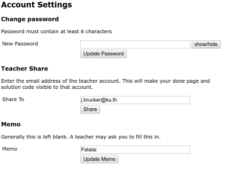

## Lab 4: Coding Practice on Codingbat.com

This lab is some relaxing and useful coding practice during Kaset Fair, using problems on [codingbat.com][codingbat].

### What to Submit

Share you scores for at least 25 solved Java problems on codingbat.com. Share scores with `j.brucker@ku.th`.

### Deadline

Deadline posted on Google Classroom.

### Instructions

1. Go to [codingbat.com][codingbat] and create an account using your **KU Gmail** account ending with `@ku.th`, e.g. `fatalai.j@ku.th`. 
    * This is so you get credit for the lab.

2. Open the **prefs** page (link at upper-right).
    * **Teacher Share**: Share your scores with `j.brucker@ku.th`, and click "Share".
    * **Memo**: Optionally add your first name in the "Memo" field and click "Update Memo".
    

3. Solve (code) at least **25 Java problems**, including problems from 5 different categories of your choice! Consider doing some AP-1 problems. You can choose any categories you like except the following **excluded** (easy) categories.     
    **Excluded Problem Categories** (too easy): 
    * Warmup-1
    * Warmup-2
    * String-1
    * Array-1
    * Logic-1
    * You can do problems from excluded categories for practice (of course), but not for lab credit.    

### Learning and Solution Aids

For each problem, [codingbat][codingbat] has explanations of Java, solution logic, and code examples.  This is a good way to improve your Java knowledge.

[codingbat]: https://codingbat.com
